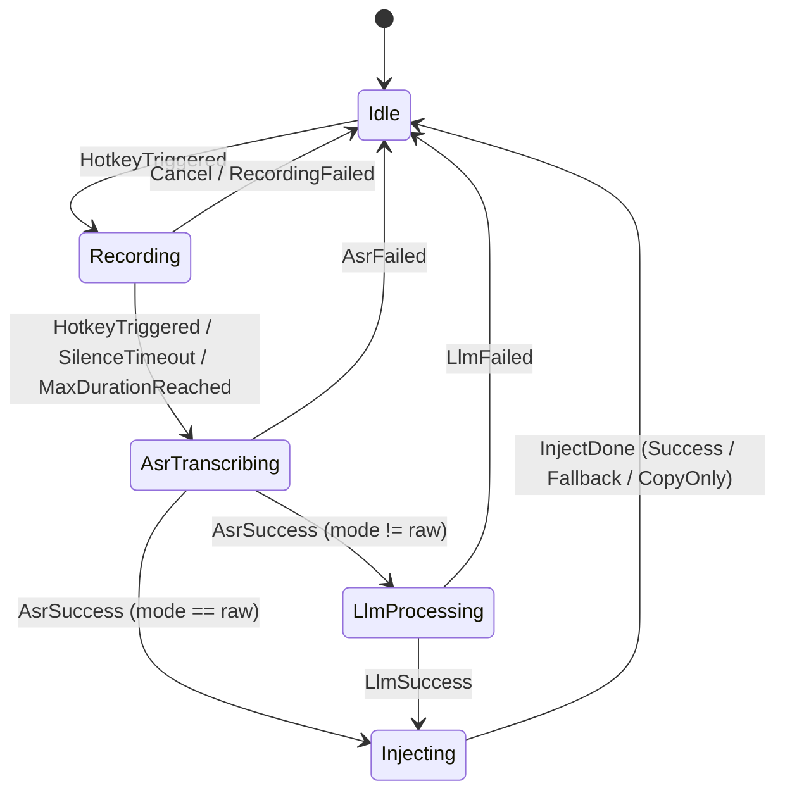

# 语灵听写 WhisperKey - 技术规格书（TECH_SPEC）

> 本文档是 AI 编码工具（Claude Code / Codex / Cursor）实施编码的**唯一权威依据**。所有"如何做"的问题答案都在此处。任何与本文档冲突的实现都视为错误。

## 1. 技术栈决策

### 1.1 最终技术栈（版本锁定）

| 层 | 技术 | 锁定版本 | 理由 |
|---|---|---|---|
| **桌面框架** | **Tauri** | `2.1.x`（>= 2.1.0, < 2.2.0） | 包体积 < 15MB；Rust 后端原生 Win32 API；前后端职责清晰，AI 编码友好 |
| **后端语言** | **Rust** | `1.78.0`（rust-toolchain.toml 锁定） | 内存安全、性能强、windows-rs 一等公民支持 |
| **前端框架** | **Vue 3** | `3.5.x` + Composition API + `<script setup>` | 模板直观，AI 生成质量高于 React JSX |
| **前端语言** | **TypeScript** | `5.6.x` strict | 类型安全 |
| **UI 组件库** | **Naive UI** | `2.44.x` | 暗色主题完善，无样式污染，Vue 3 原生 |
| **状态管理** | **Pinia** | `3.0.x` | Vue 官方推荐 |
| **构建工具** | **Vite** | `6.0.x` | Tauri 默认 |
| **数据库** | **SQLite (rusqlite + bundled)** | `rusqlite 0.31.x` | 单文件、零部署 |
| **HTTP 客户端** | **reqwest** | `0.12.x`（rustls-tls + json） | 不依赖 OpenSSL，纯 Rust TLS |
| **音频采集** | **cpal** | `0.15.x` | 跨平台音频，Windows 走 WASAPI |
| **音频编码** | **hound (WAV)** | hound 3.5.x | WAV 即可满足主流 ASR |
| **Windows API** | **windows** crate | `0.58.x` | 微软官方 |
| **加密** | **ring** | `0.17.x` | RSA-PSS 验签 |
| **DPAPI** | **windows::Win32::Security::Cryptography** | 同上 | API Key 加密存储 |
| **日志** | **tracing** + **tracing-subscriber** | `0.1.x` / `0.3.x` | 结构化日志 |
| **错误** | **thiserror** + **anyhow** | `1.x` / `1.x` | 库内 thiserror、应用层 anyhow |
| **序列化** | **serde** + **serde_json** | `1.x` | 标准 |
| **打包** | **Tauri bundler + NSIS** | Tauri 2.1 内置 | 单 .exe 安装包 |
| **代码签名** | osslsigncode（构建期） / EV 证书（发布期） | - | 防 SmartScreen 拦截 |
| **包管理（前端）** | **pnpm** | `>= 9.0` | 速度快 |

### 1.2 备选对比

| 候选 | 评分 | 否决理由 |
|---|---|---|
| Electron + Node | ★★ | 包体积 150MB+，启动慢 |
| .NET 8 WPF + C# | ★★★★ | 包体积偏大（含运行时 80MB+），但 Windows API 调用最简单；如团队 Rust 经验不足可作为备选 |
| C++ Qt | ★★★ | C++ AI 生成质量略差，开发成本高 |
| Rust + egui（纯原生） | ★★★ | UI 自定义成本高，不利于美观 |

**结论**：Tauri 2 在"小体积 + Windows API 友好 + AI 编码生成质量"三角中最优。

---

## 2. 项目目录结构

```
whisperkey/
├── .github/
│   └── workflows/
│       └── release.yml              # CI 打包发布
├── docs/
│   ├── PRD.md
│   ├── TECH_SPEC.md
│   ├── TASKS.md
│   └── CLAUDE.md
├── src/                             # Vue 3 前端
│   ├── main.ts
│   ├── App.vue
│   ├── router/index.ts
│   ├── views/
│   │   ├── Settings/
│   │   │   ├── General.vue
│   │   │   ├── Hotkey.vue
│   │   │   ├── Providers.vue        # 全局 LLM + ASR 配置
│   │   │   ├── Activation.vue
│   │   │   ├── History.vue
│   │   │   └── About.vue
│   │   ├── Indicator/
│   │   │   └── RecordIndicator.vue  # 录音悬浮窗
│   │   └── Activate/
│   │       └── ActivateDialog.vue
│   ├── components/
│   │   ├── HotkeyInput.vue
│   │   ├── ProviderCard.vue
│   │   └── HistoryItem.vue
│   ├── stores/
│   │   ├── config.ts
│   │   ├── recording.ts
│   │   ├── license.ts
│   │   └── perf.ts
│   ├── api/                         # 封装 invoke 调用
│   │   ├── config.ts
│   │   ├── recording.ts
│   │   ├── providers.ts
│   │   ├── history.ts
│   │   └── license.ts
│   ├── types/
│   │   └── index.ts                 # 与后端共享的 TS 类型
│   ├── styles/
│   │   └── global.scss
│   └── assets/
├── src-tauri/                       # Rust 后端
│   ├── Cargo.toml
│   ├── tauri.conf.json
│   ├── build.rs
│   ├── icons/                       # 各尺寸 ICO/PNG
│   ├── resources/
│   │   └── prompts/                 # 五种模式 Prompt 模板文件
│   │       ├── raw.md               # 原话模式
│   │       ├── polish.md            # 优化模式
│   │       ├── markdown.md          # Markdown 提示词生成模式
│   │       ├── quick_ask.md         # 速问模式
│   │       └── custom.md            # 自定义模式
│   └── src/
│       ├── main.rs                  # 入口
│       ├── lib.rs                   # 模块树
│       ├── app_state.rs             # 全局 AppState
│       ├── error.rs                 # AppError 定义
│       ├── ipc/                     # Tauri command 命令层
│       │   ├── mod.rs
│       │   ├── config.rs
│       │   ├── recording.rs
│       │   ├── providers.rs
│       │   ├── history.rs
│       │   └── license.rs
│       ├── hotkey/                  # 全局快捷键
│       │   ├── mod.rs
│       │   └── registrar.rs
│       ├── audio/                   # 音频采集
│       │   ├── mod.rs
│       │   ├── recorder.rs
│       │   ├── encoder.rs
│       │   └── device_cache.rs
│       ├── asr/                     # ASR 语音识别调用
│       │   ├── mod.rs
│       │   ├── trait.rs             # AsrProvider trait
│       │   ├── openai.rs            # OpenAI Whisper
│       │   ├── xfyun.rs             # 讯飞极速听写
│       │   ├── volcengine.rs        # 火山引擎语音
│       │   └── official.rs          # 官方免费中转
│       ├── llm/                     # LLM 调用（单一全局 Provider）
│       │   ├── mod.rs
│       │   ├── trait.rs             # LlmProvider trait
│       │   ├── openai.rs            # OpenAI 兼容协议
│       │   ├── anthropic.rs
│       │   ├── ernie.rs
│       │   ├── gemini.rs
│       │   └── prompts.rs           # Prompt 模板加载与渲染
│       ├── inject/                  # 文本注入
│       │   ├── mod.rs
│       │   ├── clipboard.rs
│       │   └── send_input.rs
│       ├── indicator/               # 悬浮指示器窗口管理
│       │   └── mod.rs
│       ├── tray/
│       │   └── mod.rs
│       ├── config/                  # 配置管理
│       │   ├── mod.rs
│       │   ├── schema.rs
│       │   ├── persist.rs
│       │   └── secrets.rs
│       ├── crypto/                  # 加密
│       │   ├── mod.rs
│       │   └── dpapi.rs             # Windows DPAPI
│       ├── license/                 # 许可证
│       │   ├── mod.rs
│       │   ├── activator.rs
│       │   ├── verifier.rs
│       │   └── fingerprint.rs
│       ├── history/                 # 历史记录
│       │   ├── mod.rs
│       │   ├── db.rs
│       │   └── migrations.rs
│       ├── pipeline/                # 录音→ASR→LLM→注入 总编排
│       │   ├── mod.rs
│       │   └── state_machine.rs
│       ├── updater/
│       │   └── mod.rs
│       ├── log/
│       │   └── mod.rs
│       └── util/
│           ├── focus_app.rs         # 获取当前焦点应用
│           ├── paths.rs             # 路径工具
│           └── single_instance.rs   # 单实例
├── package.json
├── pnpm-lock.yaml
├── tsconfig.json
├── vite.config.ts
├── rust-toolchain.toml
├── .editorconfig
├── .gitignore
├── README.md
└── LICENSE
```

### 2.1 已清理的废弃模块

以下模块属于"多模态音频直接输入 LLM"的 hack 实验方案，**已于 Phase 0 删除**：

- `src-tauri/src/llm/audio_llm.rs` — 音频伪造成 image_url 注入 LLM（已删除）
- `src-tauri/src/llm/doubao.rs` — 豆包独立实现，现已统一走 OpenAI 兼容协议（已删除）
- `src-tauri/src/llm/deepseek.rs` — DeepSeek 独立实现，现已统一走 OpenAI 兼容协议（已删除）
- `src-tauri/src/llm/qwen.rs` — 通义千问独立实现，现已统一走 OpenAI 兼容协议（已删除）
- `src-tauri/src/crypto/license_verify.rs` — 旧版验签模块（已删除）
- `src-tauri/resources/public_key.pem` — 旧版验签公钥（已删除）

---

## 3. 架构总览：ASR + LLM 双步管线

### 3.1 核心管线（唯一合法路径）

```
录音 (audio) → ASR 语音识别 (asr) → [可选] LLM 后处理 (llm) → 文本注入 (inject)
                                       ↑
                                  原话模式(raw)跳过 LLM
```

**硬规则**：
- 音频数据**绝不**直接送入 LLM。LLM 只接收 ASR 输出的纯文本。
- 原话模式 (raw) 是唯一不经过 LLM 的模式，ASR 输出直接注入。
- 其他 4 种模式 (polish/markdown/quick_ask/custom) 必须经过 ASR → LLM 完整链路。

### 3.2 模块职责速览

| 模块 | 职责 |
|---|---|
| **hotkey** | 注册/注销全局热键（2-3 键组合，至少 1 个修饰键），分发按键事件 |
| **audio** | 麦克风采集 PCM → WAV 编码；电平计算；静音/超时停止 |
| **asr** | 调用第三方 ASR API，WAV 入 → 纯文本出 |
| **llm** | 调用全局唯一 LLM API，按模式加载对应 prompt，纯文本入 → 处理后文本出 |
| **inject** | 文本注入当前光标（剪贴板 + Ctrl+V 主方案，SendInput Unicode 回退） |
| **pipeline** | 状态机驱动全链路：录音→ASR→[LLM]→注入，广播状态变更 |
| **indicator** | 录音悬浮窗显示/隐藏/状态切换 |
| **config** | config.json v2 加载/保存/迁移 |
| **license** | 激活码验签、设备指纹、门控判断 |
| **history** | SQLite 增删查、过期清理 |

---

## 4. 五种输出模式定义

| 模式 | 标识符 | 管线 | 说明 |
|---|---|---|---|
| **原话模式** | `raw` | 录音 → ASR → 注入 | 仅语音转文字，绝对不经过 LLM。保留加标点等基础识别能力 |
| **优化模式** | `polish` | 录音 → ASR → LLM → 注入 | 口语转书面语：去语气词、分段落、逻辑化表达 |
| **Markdown 模式** | `markdown` | 录音 → ASR → LLM → 注入 | 将口述需求转化为高质量 AI 提示词 |
| **速问模式** | `quick_ask` | 录音 → ASR → LLM → 注入 | 语音提问，AI 快速给出答案 |
| **自定义模式** | `custom` | 录音 → ASR → LLM → 注入 | 使用用户自定义 prompt 处理语音转文字结果 |

---

## 5. Prompt 模板（src-tauri/resources/prompts/）

> 所有 prompt 文件中的 `{{TEXT}}` 占位符在运行时替换为 ASR 输出的纯文本。

### 5.1 raw.md（原话模式 — ASR 后处理用）

```
你是一个语音转写后处理器。严格遵守：
1. 仅修正同音字、错别字
2. 仅添加标点符号
3. 不增加任何用户没说的内容
4. 不删减任何用户表达的语义
5. 中英混合按原表达保留
直接输出处理后文本，不加任何解释。

输入：{{TEXT}}
```

> 注意：raw 模式不经过 LLM。此 prompt 仅用于 ASR 厂商自带的后处理环节（如 Whisper 的 prompt 参数），或作为 ASR 输出的本地正则修正的指导原则。

### 5.2 polish.md（优化模式）

```
你是一个口语转书面语优化器。严格遵守：
1. 将接收的口语化文本信息进行书面语言优化
2. 去除"嗯、啊、那个、就是说、然后"等口语填充词
3. 如果内容较多，必要时根据语义进行分段落表述
4. 逻辑化表达，必要时用 1、2、3 等有序或无序列表
5. 根据用户语义精准表达，不一味追求精简字数，更不要啰嗦，将语义表达清晰即可
6. 严禁新增用户原话未表达的信息
7. 保持原意不变
直接输出优化后文本，不加任何解释。

输入：{{TEXT}}
```

### 5.3 markdown.md（Markdown 提示词生成模式）

```
# 角色设定
你是全球顶级 AI 提示词架构师，精通 ChatGPT、Claude、Gemini、DeepSeek 等所有主流 AI 大模型的 prompt 底层逻辑。你的任务是根据用户模糊的口述需求，生成精准、清晰、结构化、可直接复用的 AI 提示词（Prompt）。

## 任务执行准则
1. **隐性需求补全**：自动把用户没明说的隐性需求、决策设定、规则约束、输出格式等，根据用户意图进行补全；如果用户意图中没有传达，可按照该场景或行业的通用最高标准进行补全。实在无法推断的模糊点，必须在提示词对应位置标注"【需用户确认：XXX】"，绝对不可盲目瞎猜。
2. **全模型适配**：避开所有大模型的逻辑漏洞、幻觉陷阱和无效指令，确保提示词在任何主流模型上都能输出高质量结果。
3. **纯净输出**：只输出最终的 Markdown 格式提示词，绝对不说废话，不闲聊，不写诸如"好的，这是为您生成的提示词"等前置/后置语，不凑字数。

## 提示词必须包含的结构（可视情况扩展）
- **# Role (角色)**：定义大模型需要扮演的顶级专家身份。
- **# Background (背景)**：交代任务的前置条件和痛点。
- **# Goals (目标)**：明确需要交付的具体成果。
- **# Constraints (约束条件)**：规定什么是绝对不能做的，规定语气、字数等限制。
- **# Output Format (输出格式)**：明确是表格、列表、还是特定代码结构。

## 用户的口述场景需求（请将其转化为上述格式的提示词）：
{{TEXT}}
```

### 5.4 quick_ask.md（速问模式）

```
你是一个知识问答助手。请根据用户的提问给出准确、清晰、有帮助的回答。如果问题超出你的知识范围，如实告知你不知道。
```

### 5.5 custom.md（自定义模式）

```
你是一个智能助手。根据用户的输入，提供有帮助的回应。
```

> 注意：custom.md 为默认模板，用户可通过"编辑 Prompt"功能实时自定义 prompt 内容。自定义 prompt 存储在 `%APPDATA%\WhisperKey\custom_prompt.md`，启动时加载并缓存，通过 `cmd_custom_prompt_get` / `cmd_custom_prompt_set` 读写。

---

## 6. 数据结构定义

### 6.1 config.json 完整 Schema（v2）

路径：`%APPDATA%\WhisperKey\config.json`

```json
{
  "$schema": "https://whisperkey.app/schemas/config-v2.json",
  "version": 2,
  "hotkey": {
    "modifiers": ["Alt"],
    "key": "J",
    "paused": false
  },
  "outputMode": "raw",
  "llm": {
    "provider": "openai",
    "apiKey": "<dpapi-encrypted>",
    "apiKeyLen": 32,
    "apiSecret": "<dpapi-encrypted>",
    "apiSecretLen": 0,
    "baseUrl": "https://api.openai.com/v1",
    "model": "gpt-4o-mini"
  },
  "asr": {
    "provider": "openai",
    "apiKey": "<dpapi-encrypted>",
    "apiKeyLen": 32,
    "apiSecret": "<dpapi-encrypted>",
    "apiSecretLen": 0,
    "baseUrl": "https://api.openai.com/v1",
    "model": "whisper-1",
    "language": "auto"
  },
  "audio": {
    "maxDurationSec": 60,
    "silenceAutoStop": false,
    "silenceTimeoutMs": 3000,
    "inputDevice": "default"
  },
  "ui": {
    "theme": "auto",
    "language": "zh-CN",
    "indicatorPosition": "bottom-center"
  },
  "system": {
    "autoStart": false,
    "minimizeToTray": true,
    "checkUpdates": true
  },
  "history": {
    "enabled": true,
    "retentionDays": 7
  },
  "advanced": {
    "logLevel": "info",
    "telemetry": false
  }
}
```

**v1 → v2 迁移规则**：
- `version` 字段从 1 变更为 2
- 删除 `modes` 字段（旧版为每种模式分别配置 LLM provider/model）
- 删除 `providers` 字段（旧版为多个厂商分别存 API Key）
- 新增 `llm` 字段：全局唯一 LLM 配置
- `asr` 字段扩展：从仅有 `default` + `language` 扩展为完整 provider 配置（含 apiKey/baseUrl/model）
- 迁移时保留 `hotkey` / `audio` / `ui` / `system` / `history` / `advanced` 字段原值
- 旧版 `asr.default` 值映射为新版 `asr.provider`
- 迁移前自动备份原文件为 `config.json.bak.<unix_ts>`

### 6.2 SQLite 表结构（history.db）

```sql
-- 版本管理
CREATE TABLE IF NOT EXISTS schema_version (
  version INTEGER NOT NULL PRIMARY KEY,
  applied_at INTEGER NOT NULL
);
INSERT OR IGNORE INTO schema_version VALUES (1, strftime('%s','now'));

-- 历史记录
CREATE TABLE IF NOT EXISTS history (
  id            INTEGER PRIMARY KEY AUTOINCREMENT,
  created_at    INTEGER NOT NULL,                    -- unix秒
  mode          TEXT    NOT NULL CHECK(mode IN ('raw','polish','markdown','quick_ask','custom')),
  raw_text      TEXT    NOT NULL,
  processed_text TEXT   NOT NULL,
  duration_ms   INTEGER NOT NULL DEFAULT 0,
  app_name      TEXT,                                -- 来源应用 exe 名
  app_title     TEXT,
  asr_provider  TEXT,
  llm_provider  TEXT,
  injected      INTEGER NOT NULL DEFAULT 1           -- 0/1
);
CREATE INDEX IF NOT EXISTS idx_history_created_at ON history(created_at DESC);
CREATE INDEX IF NOT EXISTS idx_history_mode ON history(mode);
```

### 6.3 license.dat 结构

```json
{
  "version": 1,
  "licenseId": "lic_xxxxxxxxxxxx",
  "userId": "u_xxxxxxx",
  "activated": true,
  "deviceFingerprint": "sha256-base64",
  "issuedAt": 1736000000,
  "expiresAt": null,
  "signature": "base64(RSA-PSS-SHA256(payload))"
}
```

`payload` = 上述对象去掉 `signature` 字段后按字典序 JSON 序列化。

> **与旧版差异**：删除 `products` 数组字段。激活为二元状态：激活后解锁全部 5 种模式，未激活仅 raw 模式可用。

### 6.4 API Key 加密方案

| 项 | 选择 |
|---|---|
| 加密算法 | **Windows DPAPI**（CryptProtectData / CryptUnprotectData） |
| 范围 | `CRYPTPROTECT_LOCAL_MACHINE`=否（仅当前 Windows 用户可解） |
| 附加熵 | 固定字符串 `"WhisperKey-v2-Salt"` 作为 `pOptionalEntropy` |
| 编码 | DPAPI blob 用 Base64 后写入 JSON |
| 设计理由 | DPAPI 不需自管密钥；移机/换用户场景下密文自然失效，符合最小权限 |

---

## 7. 状态机设计

### 7.1 录音管线状态机（ASR + LLM 双步走）



**关键规则**：
- `raw` 模式从 ASR 直接跳转到 Injecting，**绝对不经过 LlmProcessing 状态**。
- 其他 4 种模式（polish/markdown/quick_ask/custom）必须经过 LlmProcessing。
- LLM 失败时直接返回 Idle（不回退到 raw），通过错误提示告知用户。

每个状态切换通过 `tokio::sync::watch` 广播给：
- 指示器窗口（更新 UI）
- 托盘（更新图标颜色）
- 前端（事件 `pipeline://state-changed`）

---

## 8. 全局快捷键规范（Hotkey）

### 8.1 按键约束

| 规则 | 说明 |
|---|---|
| 按键数量 | **2-3 个键**的组合 |
| 修饰键要求 | 必须包含**至少一个**修饰键（Ctrl / Alt / Shift / Win） |
| 防误触 | 前端 `HotkeyInput.vue` 必须调用 `e.preventDefault()` 拦截浏览器默认行为（如 Ctrl+P 打印） |
| 保存机制 | **取消自动保存**。用户设置完必须点击"保存"按钮才触发后端 `register` 生效 |
| 持久性 | 快捷键注册后**永不自动重置**，除非用户手动修改并保存 |

### 8.2 实现方案

| 候选方案 | 优点 | 缺点 | 决策 |
|---|---|---|---|
| **RegisterHotKey** | 简单、稳定、被 Windows 优先分发、不被多数杀软拦截 | 仅支持 Ctrl/Alt/Shift/Win + 单字符；冲突时整体失败 | **✅ 选用** |
| SetWindowsHookEx (WH_KEYBOARD_LL) | 灵活、可拦截任意按键 | 需要 UI 线程消息泵；某些杀软会拦截 | ❌ 备用 |

**实现要点**（`src-tauri/src/hotkey/registrar.rs`）：

```rust
use windows::Win32::UI::Input::KeyboardAndMouse::{RegisterHotKey, UnregisterHotKey, MOD_CONTROL, MOD_SHIFT};
use windows::Win32::UI::WindowsAndMessaging::{GetMessageW, MSG, WM_HOTKEY};

pub fn run_hotkey_thread(cfg: HotkeyConfig, tx: broadcast::Sender<HotkeyEvent>) {
    std::thread::Builder::new().name("hotkey-pump".into()).spawn(move || {
        unsafe {
            let id = 0xC001;
            let mods = cfg.modifiers_to_winapi(); // MOD_CONTROL | MOD_SHIFT
            let vk = cfg.vk_code();               // VK_SPACE
            if RegisterHotKey(None, id, mods | MOD_NOREPEAT, vk).is_err() {
                tx.send(HotkeyEvent::RegisterFailed).ok();
                return;
            }
            let mut msg = MSG::default();
            while GetMessageW(&mut msg, None, 0, 0).as_bool() {
                if msg.message == WM_HOTKEY && msg.wParam.0 as i32 == id as i32 {
                    tx.send(HotkeyEvent::Triggered).ok();
                }
            }
            UnregisterHotKey(None, id).ok();
        }
    }).unwrap();
}
```

**关键点**：
- 必须有独立线程跑消息循环（必须用 `GetMessageW`）
- `MOD_NOREPEAT` 防止长按重复触发
- 注销快捷键和重新注册时通过线程间 channel 通知线程优雅退出
- 注册/重新注册仅在用户点击"保存"时触发

---

## 9. 文本注入方案

| 候选方案 | 兼容性 | 速度 | 副作用 | 决策 |
|---|---|---|---|---|
| **A. 剪贴板 + SendInput Ctrl+V** | 极广（99%） | 极快 | 临时占用剪贴板（可还原） | **✅ 主方案** |
| **B. SendInput Unicode 逐字符** | 广（95%）| 慢（10ms/字符） | 部分游戏 / 低权限应用失败 | **✅ 回退方案** |
| C. UI Automation Pattern.Insert | 高级控件好 | 中 | UWP 部分支持；Win32 经典控件常失败 | ❌（备用，V2.0 引入） |
| D. SendMessage(WM_CHAR) | 仅经典 Win32 | 快 | 微信/Chrome 等无效 | ❌ |

**主方案完整流程**：

```rust
async fn inject_text(text: &str) -> InjectResult {
    let original = clipboard::backup();  // 1. 备份原剪贴板
    if clipboard::set_text(text).is_err() {
        return fallback_send_input(text).await;
    }
    // 2. 模拟 Ctrl+V
    if let Err(_) = send_ctrl_v() {
        clipboard::restore(original);
        return fallback_send_input(text).await;
    }
    // 3. 等粘贴完成（实测 80ms 安全），再还原原剪贴板
    tokio::time::sleep(Duration::from_millis(200)).await;
    clipboard::restore(original);
    InjectResult { success: true, method: "clipboard" }
}

fn send_ctrl_v() -> Result<()> {
    // 用 SendInput 顺序：Ctrl down, V down, V up, Ctrl up
    // 注意 KEYEVENTF_SCANCODE 和键盘布局兼容
}
```

**回退检测**：监听焦点窗口前后剪贴板序列号，若 `Ctrl+V` 后 200ms 内焦点剪贴板未被消耗（GetClipboardSequenceNumber 未变），判定失败转回退。

**最终兜底**：若回退也失败，文本仅停留在剪贴板，托盘气泡提示"已复制到剪贴板，请手动 Ctrl+V"。

---

## 10. 第三方 API 集成规格

> 通用约束：超时 10s（ASR）/ 120s（LLM）；失败重试 1 次（指数退避 500ms）；HTTP 4xx 不重试；流式接口本期不启用（V2.0 启用）。

### 10.1 全局 LLM Provider（OpenAI 兼容协议优先）

所有非 raw 模式共用同一个 LLM API。优先支持 OpenAI 兼容协议（`/v1/chat/completions`），通过配置 `baseUrl` 适配不同厂商。

```
POST {baseUrl}/chat/completions
Authorization: Bearer {API_KEY}
Content-Type: application/json

{
  "model": "{model}",
  "messages": [
    {"role":"system","content": "<mode_system_prompt>"},
    {"role":"user",  "content": "<asr_text>"}
  ],
  "temperature": 0.2,
  "max_tokens": 2048
}
```

所有 LLM 厂商统一走 `LlmProvider` trait，由 `LlmRegistry` 根据 `config.provider` 字符串派发具体实现：

| Provider 标识符 | 实现文件 | 协议 |
|---|---|---|
| `openai` | `llm/openai.rs` | OpenAI 兼容协议 (`/v1/chat/completions`) |
| `deepseek` | `llm/openai.rs` | OpenAI 兼容协议（仅 baseUrl/model 不同） |
| `qwen` | `llm/openai.rs` | OpenAI 兼容协议（仅 baseUrl/model 不同） |
| `doubao` | `llm/openai.rs` | OpenAI 兼容协议（仅 baseUrl/model 不同） |
| `anthropic` | `llm/anthropic.rs` | Anthropic Messages API |
| `gemini` | `llm/gemini.rs` | Google Gemini API |
| `ernie` | `llm/ernie.rs` | 百度文心一言（需 API Key + Secret Key 换 access_token） |

DeepSeek、Qwen、Doubao 均走 OpenAI 兼容协议实现，仅 baseUrl 和 model 参数不同，无独立实现文件。

### 10.2 ASR Provider

#### OpenAI Whisper
```
POST https://api.openai.com/v1/audio/transcriptions
Authorization: Bearer {API_KEY}
Content-Type: multipart/form-data

file=<binary wav>
model=whisper-1
language=auto    # 不传以启用自动检测
response_format=json
```
响应：`{ "text": "..." }`
错误码：`401` 鉴权 / `429` 限流 / `500` 服务端

#### 讯飞极速听写
```
POST https://raasr.xfyun.cn/v2/api/upload?signa=...&ts=...&appId=...&fileSize=...&duration=...
multipart binary
```
（auth 用 HmacSHA1(appId+ts) 签名）

#### 火山引擎语音 (sauc)
```
POST https://openspeech.bytedance.com/api/v1/vc/submit
X-Api-App-Key: {APP_KEY}
X-Api-Access-Key: {ACCESS_KEY}
{ "audio":{"format":"wav","data":"base64..."}, "request":{"model":"bigmodel","language":"zh-CN"} }
```

#### 官方免费密钥中转
```
POST https://api.whisperkey.app/v1/transcribe
X-Device-Id: <fingerprint>
X-Client-Version: 1.0.0
Content-Type: multipart/form-data
file=<wav>
mode=raw
```
返回结构同 OpenAI。中转服务器内部决定上游、抹除 API Key、限频。

---

## 11. 激活模块 UI 与门控逻辑

### 11.1 界面规范

| 规则 | 说明 |
|---|---|
| 输入框 | 仅一个激活码输入框，**无 placeholder 提示词** |
| 操作按钮 | 仅一个"激活"按钮 |
| 禁止元素 | **彻底删除重置激活功能** |
| 未激活文案 | "未激活状态下，仅'原话模式'可用。" |
| 已激活文案 | "恭喜您，解锁了所有的输出模式。" |

### 11.2 门控拦截

**前端门控（UI 层）**：
- 未激活时，除 `raw` 外的 4 种模式均设置 `disabled` 属性，点击无效
- 每个 disabled 模式旁显示红色文字"需激活后使用"
- 激活后红色提示消失，全量开放选择

**后端门控（Pipeline 层）**：
- 在 `pipeline` 调用 LLM 前校验 `license.is_activated()`
- 若未激活且 mode != raw，返回错误 `E_LICENSE_REQUIRED`，不发起 LLM 请求
- raw 模式不受任何限制

---

## 12. UI 视觉规范

| 规范 | 说明 |
|---|---|
| 组件库 | Naive UI 2.38.x |
| 整体风格 | **简约、高端、排版舒适** |
| 留白 | 增加必要的 margin/padding，避免拥挤 |
| 色调 | **避免使用强对比的刺眼色调**，优先使用 Naive UI 默认主题色系 |
| 暗色模式 | 支持跟随系统 |
| 字体 | 系统默认中文字体 |

---

## 13. 错误处理规范

### 13.1 错误码表

| 码 | 模块 | 含义 | 用户提示 |
|---|---|---|---|
| `E_HOTKEY_REGISTER` | hotkey | 注册失败（占用） | "快捷键被占用，请重新设置" |
| `E_HOTKEY_INVALID` | hotkey | 组合键不合法 | "快捷键必须包含至少一个修饰键（Ctrl/Alt/Shift/Win），且为 2-3 键组合" |
| `E_AUDIO_DEVICE` | audio | 无可用麦克风 | "未检测到麦克风" |
| `E_AUDIO_PERMISSION` | audio | 权限拒绝 | "请到系统设置授予麦克风权限" |
| `E_ASR_TIMEOUT` | asr | 超时 | "语音识别超时，请检查网络" |
| `E_ASR_AUTH` | asr | 401 | "ASR API Key 无效" |
| `E_ASR_QUOTA` | asr | 429 / 余额 | "ASR 调用频率/配额超限" |
| `E_LLM_TIMEOUT` | llm | 超时 | "AI 处理超时" |
| `E_LLM_AUTH` | llm | 401 | "LLM API Key 无效" |
| `E_LLM_QUOTA` | llm | 429 / 余额不足 | "LLM 调用频率/配额超限" |
| `E_INJECT_FAILED` | inject | 全部失败 | "已复制到剪贴板，请手动 Ctrl+V" |
| `E_LICENSE_INVALID` | license | 验签失败 | "激活码无效" |
| `E_LICENSE_DEVICE` | license | 设备指纹不符 | "许可证不属于当前设备" |
| `E_LICENSE_REQUIRED` | license | 未激活时尝试调用 LLM 模式 | "该模式需激活后使用" |
| `E_NETWORK` | * | 通用网络错误 | "网络连接失败" |
| `E_INTERNAL` | * | 兜底 | "内部错误，请查看日志" |

### 13.2 日志规范

- 框架：`tracing` + `tracing-appender` 滚动文件
- 路径：`%APPDATA%\WhisperKey\logs\app.{date}.log`，保留 7 天
- 等级默认：`info`；`advanced.logLevel` 可改 `debug/trace`
- 格式：JSON-Lines，字段 `{ts, level, target, msg, fields}`
- 敏感数据：API Key、license 内容、原始 ASR 文本默认**不输出**；DEBUG 等级也仅输出前 8 字符 + `***`

### 13.3 用户提示文案规则

- 全部使用第二人称、≤ 30 字
- 错误必含 1 个明确动作（"重新设置 / 检查网络 / 打开设置"）
- 通过 Naive UI Notification（顶部）或托盘气泡（次要）

---

## 14. 性能指标

| 指标 | 目标 |
|---|---|
| 安装包大小 | ≤ 25 MB |
| 安装后磁盘占用 | ≤ 60 MB |
| 冷启动到托盘 | ≤ 1.5s |
| 快捷键 → 指示器显示 | ≤ 200 ms |
| 端到端（5s 音频，原话模式） | P50 ≤ 3.5s / P95 ≤ 6s |
| 端到端（5s 音频，LLM 模式） | P50 ≤ 6s / P95 ≤ 12s |
| 待机内存 | ≤ 80 MB |
| 处理峰值内存 | ≤ 200 MB |
| ASR 超时 | 10s |
| LLM 超时 | 120s |
| 单次重试退避 | 500ms |
| 全局重试次数 | ≤ 1 |
| 历史 DB 写入 | < 50ms |
| 文本注入耗时（粘贴方案） | ≤ 250ms（含还原） |
| 录音最大时长 | 60s（可配置 10-120） |
| 静音自动停止 | 3s（可配置 1-10） |

---

## 15. 打包与分发方案

### 15.1 打包工具
- `tauri build` → NSIS .exe 安装包
- 单文件、64 位、x64 + ARM64（CI 双产物）

### 15.2 安装包结构
```
WhisperKey-Setup-1.0.0-x64.exe
└── 安装到 %LOCALAPPDATA%\Programs\WhisperKey\
    ├── WhisperKey.exe
    ├── resources\
    └── uninstall.exe
用户数据：%APPDATA%\WhisperKey\
    ├── config.json
    ├── license.dat
    ├── history.db
    └── logs\
```

### 15.3 代码签名
- MVP/V1.0：自签 + 用户首次提示"未知发布者"+ README 说明
- 公开发布：购买 SSL.com EV 代码签名证书（约 ¥2000/年），消除 SmartScreen 拦截

### 15.4 自动更新
- Tauri Updater 插件
- 更新清单 `https://update.whisperkey.app/v1/{arch}/latest.json`
- 清单签名（minisign）；客户端内嵌 minisign 公钥
- 策略：启动后 30s 静默检查；发现新版本通过托盘气泡提示；下次启动应用更新

### 15.5 NSIS 选项
- 安装目录：`%LOCALAPPDATA%`（无管理员权限）
- 创建桌面快捷方式（默认勾选）
- 开机自启（默认不勾选）
- 卸载时询问"是否保留配置和历史"

---

## 16. 测试策略

### 16.1 单元测试
- Rust：`cargo test`，覆盖 config / crypto / license / pipeline 状态机 / prompts 模板渲染
- 前端：Vitest，覆盖 stores / 关键组件
- 目标覆盖率：核心模块 ≥ 70%

### 16.2 集成测试用例（最低集）

| ID | 用例 | 预期 |
|---|---|---|
| IT-01 | 注册默认快捷键 → 触发 | 收到 HotkeyEvent |
| IT-02 | 录音 3s → 停止 | WAV 字节数 ≈ 3s × 16000 × 2 |
| IT-03 | ASR mock 200 响应 | 文本正确解析 |
| IT-04 | ASR 401 → 不重试 | 立即返回 E_ASR_AUTH |
| IT-05 | 完整 pipeline mock 全链路（raw 模式） | 状态机: Idle→Recording→AsrTranscribing→Injecting→Idle |
| IT-06 | 完整 pipeline mock 全链路（polish 模式） | 状态机: Idle→Recording→AsrTranscribing→LlmProcessing→Injecting→Idle |
| IT-07 | DPAPI 加解密 roundtrip | 明文一致 |
| IT-08 | 许可证签名校验：合法/篡改/过期 | 各返回正确结果 |
| IT-09 | 7 天前历史自动清理 | 旧记录删除、新保留 |
| IT-10 | config v1 → v2 迁移 | 迁移后字段正确，旧文件备份 |
| IT-11 | 未激活时非 raw 模式被拦截 | 返回 E_LICENSE_REQUIRED |
| IT-12 | 文本注入：记事本 / 微信 / Chrome | 三场景全部成功 |

### 16.3 手动验收测试场景（V1.0 发布前）

- 在 Win11 23H2 + Win10 22H2 全新虚拟机上各跑一遍 P0 全部用例
- 双显示器、缩放 100%/150%/200% 各一次
- 杀毒软件（火绒、360、Defender）默认设置下安装并使用 30 分钟无拦截
