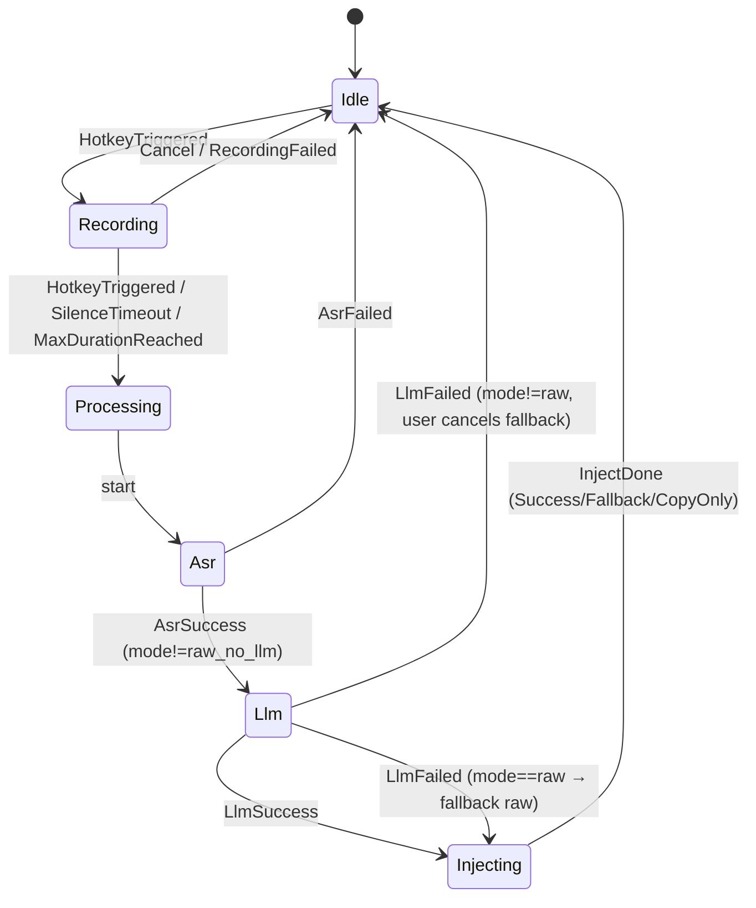

# 语灵听写 WhisperKey - 技术规格书（TECH_SPEC）

> 本文档是 AI 编码工具（Claude Code / Codex / Cursor）实施编码的**唯一权威依据**。所有"如何做"的问题答案都在此处。任何与本文档冲突的实现都视为错误。

## 1. 技术栈决策

### 1.1 最终技术栈（版本锁定）

| 层 | 技术 | 锁定版本 | 理由 |
|---|---|---|---|
| **桌面框架** | **Tauri** | `2.1.x`（>= 2.1.0, < 2.2.0） | 包体积 < 15MB；Rust 后端原生 Win32 API；前后端职责清晰，AI 编码友好 |
| **后端语言** | **Rust** | `1.78.0`（rust-toolchain.toml 锁定） | 内存安全、性能强、windows-rs 一等公民支持 |
| **前端框架** | **Vue 3** | `3.4.x` + Composition API + `<script setup>` | 模板直观，AI 生成质量高于 React JSX |
| **前端语言** | **TypeScript** | `5.4.x` strict | 类型安全 |
| **UI 组件库** | **Naive UI** | `2.38.x` | 暗色主题完善，无样式污染，Vue 3 原生 |
| **状态管理** | **Pinia** | `2.1.x` | Vue 官方推荐 |
| **构建工具** | **Vite** | `5.2.x` | Tauri 默认 |
| **数据库** | **SQLite (rusqlite + bundled)** | `rusqlite 0.31.x` | 单文件、零部署 |
| **HTTP 客户端** | **reqwest** | `0.12.x`（rustls-tls + json） | 不依赖 OpenSSL，纯 Rust TLS |
| **音频采集** | **cpal** | `0.15.x` | 跨平台音频，Windows 走 WASAPI |
| **音频编码** | **hound (WAV)** + **opus (rust-opus)** 备用 | hound 3.5.x | WAV 即可满足主流 ASR |
| **Windows API** | **windows** crate | `0.58.x` | 微软官方 |
| **加密** | **ring** | `0.17.x` | RSA-PSS 验签 |
| **DPAPI** | **windows::Win32::Security::Cryptography** | 同上 | API Key 加密存储 |
| **日志** | **tracing** + **tracing-subscriber** | `0.1.x` / `0.3.x` | 结构化日志 |
| **错误** | **thiserror** + **anyhow** | `1.x` / `1.x` | 库内 thiserror、应用层 anyhow |
| **序列化** | **serde** + **serde_json** | `1.x` | 标准 |
| **打包** | **Tauri bundler + NSIS** | Tauri 2.1 内置 | 单 .exe 安装包 |
| **代码签名** | osslsigncode（构建期） / EV 证书（发布期） | - | 防 SmartScreen 拦截 |
| **包管理（前端）** | **pnpm** | `>= 9.0` | 速度快 |

### 1.2 备选对比

| 候选 | 评分 | 否决理由 |
|---|---|---|
| Electron + Node | ★★ | 包体积 150MB+，启动慢 |
| .NET 8 WPF + C# | ★★★★ | 包体积偏大（含运行时 80MB+），但 Windows API 调用最简单；如团队 Rust 经验不足可作为备选 |
| C++ Qt | ★★★ | C++ AI 生成质量略差，开发成本高 |
| Rust + egui（纯原生） | ★★★ | UI 自定义成本高，不利于美观 |

**结论**：Tauri 2 在"小体积 + Windows API 友好 + AI 编码生成质量"三角中最优。

---

## 2. 项目目录结构

```
whisperkey/
├── .github/
│   └── workflows/
│       └── release.yml              # CI 打包发布
├── docs/
│   ├── PRD.md
│   ├── TECH_SPEC.md
│   ├── TASKS.md
│   ├── CLAUDE.md
│   └── AGENTS.md
├── src/                             # Vue 3 前端
│   ├── main.ts
│   ├── App.vue
│   ├── router/index.ts
│   ├── views/
│   │   ├── Settings/
│   │   │   ├── General.vue
│   │   │   ├── Hotkey.vue
│   │   │   ├── Providers.vue
│   │   │   ├── Activation.vue
│   │   │   ├── History.vue
│   │   │   └── About.vue
│   │   ├── Indicator/
│   │   │   └── RecordIndicator.vue  # 录音悬浮窗
│   │   └── Activate/
│   │       └── ActivateDialog.vue
│   ├── components/
│   │   ├── HotkeyInput.vue
│   │   ├── ProviderCard.vue
│   │   └── HistoryItem.vue
│   ├── stores/
│   │   ├── config.ts
│   │   ├── recording.ts
│   │   └── license.ts
│   ├── api/                         # 封装 invoke 调用
│   │   ├── config.ts
│   │   ├── recording.ts
│   │   ├── providers.ts
│   │   ├── history.ts
│   │   └── license.ts
│   ├── types/
│   │   └── index.ts                 # 与后端共享的 TS 类型
│   ├── styles/
│   │   └── global.scss
│   └── assets/
├── src-tauri/                       # Rust 后端
│   ├── Cargo.toml
│   ├── tauri.conf.json
│   ├── build.rs
│   ├── icons/                       # 各尺寸 ICO/PNG
│   ├── resources/
│   │   ├── prompts/                 # System Prompt 文件
│   │   │   ├── raw.md
│   │   │   ├── polish.md
│   │   │   └── markdown.md
│   │   └── public_key.pem           # 许可证验签公钥
│   └── src/
│       ├── main.rs                  # 入口
│       ├── lib.rs                   # 模块树
│       ├── app_state.rs             # 全局 AppState
│       ├── error.rs                 # AppError 定义
│       ├── ipc/                     # Tauri command 命令层
│       │   ├── mod.rs
│       │   ├── config.rs
│       │   ├── recording.rs
│       │   ├── providers.rs
│       │   ├── history.rs
│       │   └── license.rs
│       ├── hotkey/                  # 全局快捷键
│       │   ├── mod.rs
│       │   └── registrar.rs
│       ├── audio/                   # 音频采集
│       │   ├── mod.rs
│       │   ├── recorder.rs
│       │   └── encoder.rs
│       ├── asr/                     # ASR 调用
│       │   ├── mod.rs
│       │   ├── trait.rs             # AsrProvider trait
│       │   ├── openai.rs
│       │   ├── xfyun.rs
│       │   ├── volcengine.rs
│       │   └── official.rs          # 官方免费密钥
│       ├── llm/                     # LLM 调用
│       │   ├── mod.rs
│       │   ├── trait.rs             # LlmProvider trait
│       │   ├── openai.rs
│       │   ├── anthropic.rs
│       │   ├── deepseek.rs
│       │   ├── qwen.rs
│       │   ├── ernie.rs
│       │   ├── doubao.rs
│       │   ├── gemini.rs
│       │   └── prompts.rs           # 三种模式 Prompt 模板
│       ├── inject/                  # 文本注入
│       │   ├── mod.rs
│       │   ├── clipboard.rs
│       │   └── send_input.rs
│       ├── indicator/               # 悬浮指示器窗口管理
│       │   └── mod.rs
│       ├── tray/
│       │   └── mod.rs
│       ├── config/                  # 配置管理
│       │   ├── mod.rs
│       │   ├── schema.rs
│       │   └── persist.rs
│       ├── crypto/                  # 加密
│       │   ├── mod.rs
│       │   ├── dpapi.rs             # Windows DPAPI
│       │   └── license_verify.rs
│       ├── license/                 # 许可证
│       │   ├── mod.rs
│       │   ├── activator.rs
│       │   ├── verifier.rs
│       │   └── fingerprint.rs
│       ├── history/                 # 历史记录
│       │   ├── mod.rs
│       │   ├── db.rs
│       │   └── migrations.rs
│       ├── pipeline/                # 录音→ASR→LLM→注入 总编排
│       │   ├── mod.rs
│       │   └── state_machine.rs
│       ├── updater/
│       │   └── mod.rs
│       ├── log/
│       │   └── mod.rs
│       └── util/
│           ├── focus_app.rs         # 获取当前焦点应用
│           └── single_instance.rs   # 单实例
├── package.json
├── pnpm-lock.yaml
├── tsconfig.json
├── vite.config.ts
├── rust-toolchain.toml
├── .editorconfig
├── .gitignore
├── README.md
└── LICENSE
```

---

## 3. 模块划分

### 3.1 hotkey - 全局快捷键

| 项 | 内容 |
|---|---|
| 职责 | 注册/注销全局热键，分发按键事件 |
| 输入 | `HotkeyConfig { modifiers: Vec<Mod>, key: VK }` |
| 输出 | `tokio::sync::broadcast::Sender<HotkeyEvent>` |
| 对外接口 | `register(cfg)`, `unregister()`, `is_paused()`, `pause()`, `resume()` |
| 依赖 | windows crate, app_state |
| 关键技术 | **RegisterHotKey + GetMessage 消息循环**（详见 4.1） |

### 3.2 audio - 音频采集

| 项 | 内容 |
|---|---|
| 职责 | 麦克风采集 PCM、电平计算、停止条件判断 |
| 输入 | 启动信号；可选 max_duration、silence_threshold |
| 输出 | `AudioBuffer { wav_bytes: Vec<u8>, duration_ms: u64 }` + 实时电平流 |
| 对外接口 | `start()`, `stop()`, `level_stream()`, `wav_bytes()` |
| 依赖 | cpal, hound |
| 关键技术 | WASAPI 共享模式 16kHz/16bit/mono；环形缓冲；RMS 静音检测 |

### 3.3 asr - 语音识别

| 项 | 内容 |
|---|---|
| 职责 | 调用第三方 ASR API，返回文本 |
| 输入 | `AsrRequest { wav: Vec<u8>, language: "auto" }` |
| 输出 | `AsrResponse { text: String, confidence: f32 }` |
| 对外接口 | `trait AsrProvider { async fn transcribe(req) -> Result<resp> }` |
| 依赖 | reqwest, config |
| 关键技术 | 多厂商适配器（详见 5）、超时 10s、重试 1 次 |

### 3.4 llm - 大模型调用

| 项 | 内容 |
|---|---|
| 职责 | 按模式调用 LLM 后处理 |
| 输入 | `LlmRequest { mode, raw_text, system_prompt, user_prompt }` |
| 输出 | `LlmResponse { text }` |
| 对外接口 | `trait LlmProvider { async fn chat(req) -> Result<resp> }` |
| 依赖 | reqwest, prompts, config, license |
| 关键技术 | OpenAI 兼容协议优先；模式 B/C 调用前校验 license |

### 3.5 inject - 文本注入

| 项 | 内容 |
|---|---|
| 职责 | 把文本写入当前光标 |
| 输入 | `text: String` |
| 输出 | `InjectResult { success, method: "clipboard"\|"sendinput"\|"clipboard_only" }` |
| 对外接口 | `inject(text)` |
| 依赖 | windows crate |
| 关键技术 | 详见 4.2 |

### 3.6 indicator - 悬浮指示器

| 项 | 内容 |
|---|---|
| 职责 | 录音悬浮窗的显示/隐藏/状态切换 |
| 接口 | `show(mode)`, `set_state(Recording \| Processing)`, `update_level(f32)`, `hide()` |
| 关键技术 | Tauri 第二个窗口；`alwaysOnTop=true`、`decorations=false`、`transparent=true`、`skipTaskbar=true`、`focus=false`；Win32 上额外加 `WS_EX_NOACTIVATE \| WS_EX_TOOLWINDOW \| WS_EX_LAYERED \| WS_EX_TRANSPARENT` |

### 3.7 config - 配置管理

| 项 | 内容 |
|---|---|
| 职责 | 加载/保存/迁移 config.json |
| 接口 | `load()`, `save()`, `get<T>(path)`, `set<T>(path, v)`, `subscribe(path, cb)` |
| 路径 | `%APPDATA%\WhisperKey\config.json` |
| 关键技术 | 写入加 `.lock` + 原子 rename；schema 版本字段触发迁移 |

### 3.8 license - 许可证

| 项 | 内容 |
|---|---|
| 职责 | 激活、验签、机器指纹 |
| 接口 | `activate(code)`, `is_unlocked(product)`, `unbind()` |
| 路径 | `%APPDATA%\WhisperKey\license.dat` |
| 关键技术 | RSA-PSS-2048 验签；机器指纹 = SHA256(MachineGuid + 主板 UUID 前 8 位) |

### 3.9 history - 历史记录

| 项 | 内容 |
|---|---|
| 职责 | SQLite 增删查、过期清理 |
| 接口 | `add(rec)`, `list(filter, page)`, `delete(id)`, `clear()`, `purge_old()` |
| 路径 | `%APPDATA%\WhisperKey\history.db` |

### 3.10 ipc - Tauri 命令层

| 项 | 内容 |
|---|---|
| 职责 | 暴露给前端的 `#[tauri::command]` |
| 命名规范 | `cmd_<module>_<verb>`，如 `cmd_config_get`, `cmd_recording_toggle` |

### 3.11 tray - 系统托盘

| 项 | 内容 |
|---|---|
| 职责 | 托盘菜单与事件 |
| 关键技术 | Tauri 2 `tauri::tray::TrayIconBuilder` |

### 3.12 pipeline - 总编排

| 项 | 内容 |
|---|---|
| 职责 | 录音→ASR→LLM→注入的状态机驱动 |
| 关键技术 | 见 7 节状态机 |

### 3.13 updater - 自动更新

| 项 | 内容 |
|---|---|
| 职责 | 检查/下载更新 |
| 关键技术 | Tauri Updater 插件，更新清单签名校验 |

### 3.14 crypto - 加密

| 项 | 内容 |
|---|---|
| 职责 | DPAPI 包装、许可证验签 |

---

## 4. 关键技术实现方案

### 4.1 全局键盘钩子

| 候选方案 | 优点 | 缺点 | 决策 |
|---|---|---|---|
| **RegisterHotKey** | 简单、稳定、被 Windows 优先分发、不被多数杀软拦截 | 仅支持 Ctrl/Alt/Shift/Win + 单字符；冲突时整体失败 | **✅ 选用** |
| SetWindowsHookEx (WH_KEYBOARD_LL) | 灵活、可拦截任意按键 | 需要 UI 线程消息泵；某些杀软会拦截；性能影响微小但敏感场景明显 | ❌ 备用（用户自定义复杂键序时再考虑） |
| Raw Input | 高性能 | 需独立 hidden 窗口接收 WM_INPUT；实现复杂 | ❌ |

**实现方案（Rust + windows crate）**：

```rust
// 伪代码（src-tauri/src/hotkey/registrar.rs）
use windows::Win32::UI::Input::KeyboardAndMouse::{RegisterHotKey, UnregisterHotKey, MOD_CONTROL, MOD_SHIFT};
use windows::Win32::UI::WindowsAndMessaging::{GetMessageW, MSG, WM_HOTKEY};

pub fn run_hotkey_thread(cfg: HotkeyConfig, tx: broadcast::Sender<HotkeyEvent>) {
    std::thread::Builder::new().name("hotkey-pump".into()).spawn(move || {
        unsafe {
            let id = 0xC001;
            let mods = cfg.modifiers_to_winapi(); // MOD_CONTROL | MOD_SHIFT
            let vk = cfg.vk_code();               // VK_SPACE
            if RegisterHotKey(None, id, mods | MOD_NOREPEAT, vk).is_err() {
                tx.send(HotkeyEvent::RegisterFailed).ok();
                return;
            }
            let mut msg = MSG::default();
            while GetMessageW(&mut msg, None, 0, 0).as_bool() {
                if msg.message == WM_HOTKEY && msg.wParam.0 as i32 == id as i32 {
                    tx.send(HotkeyEvent::Triggered).ok();
                }
            }
            UnregisterHotKey(None, id).ok();
        }
    }).unwrap();
}
```

**关键点**：
- 必须有独立线程跑消息循环（必须用 `GetMessageW`）
- `MOD_NOREPEAT` 防止长按重复触发
- 注销快捷键和重新注册时通过线程间 channel 通知线程优雅退出

### 4.2 全局文本注入

| 候选方案 | 兼容性 | 速度 | 副作用 | 决策 |
|---|---|---|---|---|
| **A. 剪贴板 + SendInput Ctrl+V** | 极广（99%） | 极快 | 临时占用剪贴板（可还原） | **✅ 主方案** |
| **B. SendInput Unicode 逐字符** | 广（95%）| 慢（10ms/字符） | 部分游戏 / 低权限应用失败 | **✅ 回退方案** |
| C. UI Automation Pattern.Insert | 高级控件好 | 中 | UWP 部分支持；Win32 经典控件常失败 | ❌（备用，V2.0 引入） |
| D. SendMessage(WM_CHAR) | 仅经典 Win32 | 快 | 微信/Chrome 等无效 | ❌ |

**主方案完整流程**：

```rust
async fn inject_text(text: &str) -> InjectResult {
    let original = clipboard::backup();  // 1. 备份原剪贴板
    if clipboard::set_text(text).is_err() {
        return fallback_send_input(text).await;
    }
    // 2. 模拟 Ctrl+V
    if let Err(_) = send_ctrl_v() {
        clipboard::restore(original);
        return fallback_send_input(text).await;
    }
    // 3. 等粘贴完成（实测 80ms 安全），再还原原剪贴板
    tokio::time::sleep(Duration::from_millis(200)).await;
    clipboard::restore(original);
    InjectResult { success: true, method: "clipboard" }
}

fn send_ctrl_v() -> Result<()> {
    // 用 SendInput 顺序：Ctrl down, V down, V up, Ctrl up
    // 注意 KEYEVENTF_SCANCODE 和键盘布局兼容
}
```

**回退检测**：监听焦点窗口前后剪贴板序列号，若 `Ctrl+V` 后 200ms 内焦点剪贴板未被消耗（GetClipboardSequenceNumber 未变），判定失败转回退。

**最终兜底**：若回退也失败，文本仅停留在剪贴板，托盘气泡提示"已复制到剪贴板，请手动 Ctrl+V"。

### 4.3 全局悬浮窗置顶（不抢焦点 + 透传点击）

```jsonc
// tauri.conf.json - indicator 窗口配置
{
  "label": "indicator",
  "url": "/indicator",
  "width": 200, "height": 40,
  "decorations": false,
  "transparent": true,
  "alwaysOnTop": true,
  "skipTaskbar": true,
  "focus": false,
  "resizable": false,
  "visible": false,
  "shadow": false
}
```

**额外 Win32 扩展样式**（在 setup 钩子中给窗口 HWND 加）：
```rust
let hwnd = window.hwnd().unwrap();
let mut style = GetWindowLongPtrW(hwnd, GWL_EXSTYLE);
style |= (WS_EX_NOACTIVATE | WS_EX_TOOLWINDOW | WS_EX_TRANSPARENT | WS_EX_LAYERED) as isize;
SetWindowLongPtrW(hwnd, GWL_EXSTYLE, style);
```

定位：屏幕坐标 `(workArea.right/2 - 100, workArea.bottom - 100)`。多屏取主屏。

### 4.4 麦克风权限

Windows 11 的"麦克风访问权限"需用户手动在设置中授权。处理：
1. 启动时尝试 cpal 打开默认输入设备
2. 失败错误码若为 `0x80070005 (Access Denied)`：弹窗 + 一键 `start ms-settings:privacy-microphone`
3. 用户首次成功录音前不再弹

---

## 5. 第三方 API 集成规格

> 通用约束：超时 10s（ASR）/ 15s（LLM）；失败重试 1 次（指数退避 500ms）；HTTP 4xx 不重试；流式接口本期不启用（V2.0 启用）。

### 5.1 OpenAI Whisper（ASR）

```
POST https://api.openai.com/v1/audio/transcriptions
Authorization: Bearer {API_KEY}
Content-Type: multipart/form-data

file=<binary wav>
model=whisper-1
language=auto    # 不传以启用自动检测
response_format=json
```
响应：
```json
{ "text": "..." }
```
错误码：`401`鉴权 / `429`限流 / `500`服务端

### 5.2 OpenAI Chat（LLM）

```
POST https://api.openai.com/v1/chat/completions
Authorization: Bearer {API_KEY}
Content-Type: application/json

{
  "model": "gpt-4o-mini",
  "messages": [
    {"role":"system","content": "<system_prompt>"},
    {"role":"user",  "content": "<raw_text>"}
  ],
  "temperature": 0.2,
  "max_tokens": 2048
}
```

### 5.3 Anthropic Claude

```
POST https://api.anthropic.com/v1/messages
x-api-key: {API_KEY}
anthropic-version: 2023-06-01
Content-Type: application/json

{
  "model": "claude-3-5-haiku-20241022",
  "max_tokens": 2048,
  "system": "<system_prompt>",
  "messages": [{"role":"user","content":"<raw_text>"}]
}
```

### 5.4 DeepSeek（OpenAI 兼容）

```
POST https://api.deepseek.com/v1/chat/completions
Authorization: Bearer {API_KEY}
Content-Type: application/json
{ "model": "deepseek-chat", ... }
```

### 5.5 通义千问 Qwen

```
POST https://dashscope.aliyuncs.com/compatible-mode/v1/chat/completions
Authorization: Bearer {API_KEY}
{ "model": "qwen-turbo", ... }   # OpenAI 兼容
```

### 5.6 文心一言

需先用 API_KEY + SECRET_KEY 换 access_token：
```
POST https://aip.baidubce.com/oauth/2.0/token?grant_type=client_credentials&client_id={ak}&client_secret={sk}
```
然后：
```
POST https://aip.baidubce.com/rpc/2.0/ai_custom/v1/wenxinworkshop/chat/ernie-4.0-turbo-8k?access_token={token}
{ "messages": [...] }
```

### 5.7 豆包（火山方舟，OpenAI 兼容）

```
POST https://ark.cn-beijing.volces.com/api/v3/chat/completions
Authorization: Bearer {API_KEY}
{ "model": "doubao-pro-32k-{ENDPOINT_ID}" }
```

### 5.8 Gemini

```
POST https://generativelanguage.googleapis.com/v1beta/models/gemini-2.0-flash:generateContent?key={API_KEY}
{
  "system_instruction": {"parts":[{"text":"..."}]},
  "contents": [{"role":"user","parts":[{"text":"..."}]}],
  "generationConfig": {"temperature":0.2}
}
```

### 5.9 讯飞极速听写 ASR

```
POST https://raasr.xfyun.cn/v2/api/upload?signa=...&ts=...&appId=...&fileSize=...&duration=...
multipart binary
```
（auth 用 HmacSHA1(appId+ts) 签名）

### 5.10 火山引擎语音 ASR (sauc)

```
POST https://openspeech.bytedance.com/api/v1/vc/submit
X-Api-App-Key: {APP_KEY}
X-Api-Access-Key: {ACCESS_KEY}
{ "audio":{"format":"wav","data":"base64..."}, "request":{"model":"bigmodel","language":"zh-CN"} }
```

### 5.11 官方免费密钥中转

```
POST https://api.whisperkey.app/v1/transcribe
X-Device-Id: <fingerprint>
X-Client-Version: 1.0.0
Content-Type: multipart/form-data
file=<wav>
mode=raw
```
返回结构同 OpenAI。中转服务器内部决定上游、抹除 API Key、限频。

### 5.12 Prompt 模板（resources/prompts/）

**raw.md（原话模式）**：
```
你是一个语音转写后处理器。严格遵守：
1. 仅修正同音字、错别字
2. 仅添加标点符号
3. 不增加任何用户没说的内容
4. 不删减任何用户表达的语义
5. 中英混合按原表达保留
直接输出处理后文本，不加任何解释。

输入：{{TEXT}}
```

**polish.md（优化模式）**：
```
你是一个口语转书面语优化器。严格遵守：
1. 删除"嗯/呃/啊/那个/这个/就是说/然后"等口语填充词
2. 合并重复表达，理顺语序
3. 严禁新增用户原话未表达的信息
4. 输出长度不得超过原文 120%
5. 保持原意不变
直接输出优化后文本，不加解释。

输入：{{TEXT}}
```

**markdown.md（Markdown 模式）**：
```
你是一个 Prompt 工程师。把用户口述的需求改写为高质量 Markdown 格式提示词，包含：
# 任务
## 背景
## 要求
## 输出格式
仅当用户提及了相关信息才生成对应小节，不可凭空捏造。直接输出 Markdown，不加解释。

输入：{{TEXT}}
```

---

## 6. 数据结构定义

### 6.1 config.json 完整 Schema

路径：`%APPDATA%\WhisperKey\config.json`

```json
{
  "$schema": "https://whisperkey.app/schemas/config-v1.json",
  "version": 1,
  "hotkey": {
    "modifiers": ["Ctrl", "Shift"],
    "key": "Space",
    "paused": false
  },
  "modes": {
    "default": "raw",
    "raw":      { "llmProvider": "official", "llmModel": "default" },
    "polish":   { "llmProvider": "deepseek", "llmModel": "deepseek-chat" },
    "markdown": { "llmProvider": "anthropic", "llmModel": "claude-3-5-haiku-20241022" }
  },
  "asr": {
    "default": "official",
    "language": "auto"
  },
  "providers": {
    "openai":    { "apiKey": "<dpapi-encrypted>", "baseUrl": "https://api.openai.com/v1" },
    "anthropic": { "apiKey": "<dpapi-encrypted>", "baseUrl": "https://api.anthropic.com" },
    "deepseek":  { "apiKey": "<dpapi-encrypted>", "baseUrl": "https://api.deepseek.com/v1" },
    "qwen":      { "apiKey": "<dpapi-encrypted>", "baseUrl": "https://dashscope.aliyuncs.com/compatible-mode/v1" },
    "ernie":     { "apiKey": "<dpapi-encrypted>", "secretKey": "<dpapi-encrypted>" },
    "doubao":    { "apiKey": "<dpapi-encrypted>", "endpointId": "<plain>" },
    "gemini":    { "apiKey": "<dpapi-encrypted>" },
    "xfyun":     { "appId": "<plain>", "apiKey": "<dpapi-encrypted>", "apiSecret": "<dpapi-encrypted>" },
    "volcengine":{ "appKey": "<plain>", "accessKey": "<dpapi-encrypted>" },
    "official":  {}
  },
  "audio": {
    "maxDurationSec": 60,
    "silenceAutoStop": false,
    "silenceTimeoutMs": 3000,
    "inputDevice": "default"
  },
  "ui": {
    "theme": "auto",
    "language": "zh-CN",
    "indicatorPosition": "bottom-center"
  },
  "system": {
    "autoStart": false,
    "minimizeToTray": true,
    "checkUpdates": true
  },
  "history": {
    "enabled": true,
    "retentionDays": 7
  },
  "advanced": {
    "logLevel": "info",
    "telemetry": false
  }
}
```

### 6.2 SQLite 表结构（history.db）

```sql
-- 版本管理
CREATE TABLE IF NOT EXISTS schema_version (
  version INTEGER NOT NULL PRIMARY KEY,
  applied_at INTEGER NOT NULL
);
INSERT OR IGNORE INTO schema_version VALUES (1, strftime('%s','now'));

-- 历史记录
CREATE TABLE IF NOT EXISTS history (
  id            INTEGER PRIMARY KEY AUTOINCREMENT,
  created_at    INTEGER NOT NULL,                    -- unix秒
  mode          TEXT    NOT NULL CHECK(mode IN ('raw','polish','markdown')),
  raw_text      TEXT    NOT NULL,
  processed_text TEXT   NOT NULL,
  duration_ms   INTEGER NOT NULL DEFAULT 0,
  app_name      TEXT,                                -- 来源应用 exe 名
  app_title     TEXT,
  asr_provider  TEXT,
  llm_provider  TEXT,
  injected      INTEGER NOT NULL DEFAULT 1           -- 0/1
);
CREATE INDEX IF NOT EXISTS idx_history_created_at ON history(created_at DESC);
CREATE INDEX IF NOT EXISTS idx_history_mode ON history(mode);
```

### 6.3 license.dat 结构

```json
{
  "version": 1,
  "licenseId": "lic_xxxxxxxxxxxx",
  "userId": "u_xxxxxxx",
  "products": ["polish", "markdown"],
  "deviceFingerprint": "sha256-base64",
  "issuedAt": 1736000000,
  "expiresAt": null,
  "signature": "base64(RSA-PSS-SHA256(payload))"
}
```

`payload` = 上述对象去掉 `signature` 字段后按字典序 JSON 序列化。

### 6.4 API Key 加密方案

| 项 | 选择 |
|---|---|
| 加密算法 | **Windows DPAPI**（CryptProtectData / CryptUnprotectData） |
| 范围 | `CRYPTPROTECT_LOCAL_MACHINE`=否（仅当前 Windows 用户可解） |
| 附加熵 | 固定字符串 `"WhisperKey-v1-Salt"` 作为 `pOptionalEntropy` |
| 编码 | DPAPI blob 用 Base64 后写入 JSON |
| 设计理由 | DPAPI 不需自管密钥；移机/换用户场景下密文自然失效，符合最小权限 |

---

## 7. 状态机设计

### 7.1 录音管线状态机



每个状态切换通过 `tokio::sync::watch` 广播给：
- 指示器窗口（更新 UI）
- 托盘（更新图标颜色）
- 前端（事件 `pipeline://state-changed`）

---

## 8. 错误处理规范

### 8.1 错误码表

| 码 | 模块 | 含义 | 用户提示 |
|---|---|---|---|
| `E_HOTKEY_REGISTER` | hotkey | 注册失败（占用） | "快捷键被占用，请重新设置" |
| `E_AUDIO_DEVICE` | audio | 无可用麦克风 | "未检测到麦克风" |
| `E_AUDIO_PERMISSION` | audio | 权限拒绝 | "请到系统设置授予麦克风权限" |
| `E_ASR_TIMEOUT` | asr | 超时 | "识别超时，请检查网络" |
| `E_ASR_AUTH` | asr | 401 | "API Key 无效" |
| `E_ASR_QUOTA` | asr | 429 / 余额 | "调用频率/配额超限" |
| `E_LLM_TIMEOUT` | llm | 超时 | "AI 处理超时" |
| `E_LLM_AUTH` | llm | 401 | "API Key 无效" |
| `E_INJECT_FAILED` | inject | 全部失败 | "已复制到剪贴板，请手动 Ctrl+V" |
| `E_LICENSE_INVALID` | license | 验签失败 | "激活码无效" |
| `E_LICENSE_DEVICE` | license | 设备指纹不符 | "许可证不属于当前设备" |
| `E_NETWORK` | * | 通用网络错误 | "网络连接失败" |
| `E_INTERNAL` | * | 兜底 | "内部错误，请查看日志" |

### 8.2 日志规范

- 框架：`tracing` + `tracing-appender` 滚动文件
- 路径：`%APPDATA%\WhisperKey\logs\app.{date}.log`，保留 7 天
- 等级默认：`info`；`advanced.logLevel` 可改 `debug/trace`
- 格式：JSON-Lines，字段 `{ts, level, target, msg, fields}`
- 敏感数据：API Key、license 内容、原始 ASR 文本默认**不输出**；DEBUG 等级也仅输出前 8 字符 + `***`

### 8.3 用户提示文案规则

- 全部使用第二人称、≤ 30 字
- 错误必含 1 个明确动作（"重新设置 / 检查网络 / 打开设置"）
- 通过 Naive UI Notification（顶部）或 托盘气泡（次要）

---

## 9. 性能指标

| 指标 | 目标 |
|---|---|
| 安装包大小 | ≤ 25 MB |
| 安装后磁盘占用 | ≤ 60 MB |
| 冷启动到托盘 | ≤ 1.5s |
| 快捷键 → 指示器显示 | ≤ 200 ms |
| 端到端（5s 音频，原话模式） | P50 ≤ 3.5s / P95 ≤ 6s |
| 待机内存 | ≤ 80 MB |
| 处理峰值内存 | ≤ 200 MB |
| ASR 超时 | 10s |
| LLM 超时 | 15s |
| 单次重试退避 | 500ms |
| 全局重试次数 | ≤ 1 |
| 历史 DB 写入 | < 50ms |
| 文本注入耗时（粘贴方案） | ≤ 250ms（含还原） |
| 录音最大时长 | 60s（可配置 10-120） |
| 静音自动停止 | 3s（可配置 1-10） |

---

## 10. 打包与分发方案

### 10.1 打包工具
- `tauri build` → NSIS .exe 安装包
- 单文件、64 位、x64 + ARM64（CI 双产物）

### 10.2 安装包结构
```
WhisperKey-Setup-1.0.0-x64.exe
└── 安装到 %LOCALAPPDATA%\Programs\WhisperKey\
    ├── WhisperKey.exe
    ├── resources\
    └── uninstall.exe
用户数据：%APPDATA%\WhisperKey\
    ├── config.json
    ├── license.dat
    ├── history.db
    └── logs\
```

### 10.3 代码签名
- MVP/V1.0：自签 + 用户首次提示"未知发布者"+ README 说明
- 公开发布：购买 SSL.com EV 代码签名证书（约 ¥2000/年），消除 SmartScreen 拦截

### 10.4 自动更新
- Tauri Updater 插件
- 更新清单 `https://update.whisperkey.app/v1/{arch}/latest.json`
- 清单签名（minisign）；客户端内嵌 minisign 公钥
- 策略：启动后 30s 静默检查；发现新版本通过托盘气泡提示；下次启动应用更新

### 10.5 NSIS 选项
- 安装目录：`%LOCALAPPDATA%`（无管理员权限）
- 创建桌面快捷方式（默认勾选）
- 开机自启（默认不勾选）
- 卸载时询问"是否保留配置和历史"

---

## 11. 测试策略

### 11.1 单元测试
- Rust：`cargo test`，覆盖 config / crypto / license / pipeline 状态机 / prompts 正则校验
- 前端：Vitest，覆盖 stores / 关键组件
- 目标覆盖率：核心模块 ≥ 70%

### 11.2 集成测试用例（最低集）

| ID | 用例 | 预期 |
|---|---|---|
| IT-01 | 注册默认快捷键 → 触发 | 收到 HotkeyEvent |
| IT-02 | 录音 3s → 停止 | WAV 字节数 ≈ 3s × 16000 × 2 |
| IT-03 | OpenAI provider mock 200 响应 | 文本正确解析 |
| IT-04 | OpenAI 401 → 重试 1 次 | 不重试，立即返回 E_ASR_AUTH |
| IT-05 | 完整 pipeline mock 全链路 | 状态机覆盖全路径 |
| IT-06 | DPAPI 加解密 roundtrip | 明文一致 |
| IT-07 | 许可证签名校验：合法/篡改/过期 | 各返回正确结果 |
| IT-08 | 7 天前历史自动清理 | 旧记录删除、新保留 |
| IT-09 | config 损坏 → 自动备份重建 | 程序仍可启动 |
| IT-10 | 文本注入：记事本 / 微信 / Chrome | 三场景全部成功 |

### 11.3 手动验收测试场景（V1.0 发布前）

- 在 Win11 23H2 + Win10 22H2 全新虚拟机上各跑一遍 P0 全部用例
- 双显示器、缩放 100%/150%/200% 各一次
- 杀毒软件（火绒、360、Defender）默认设置下安装并使用 30 分钟无拦截